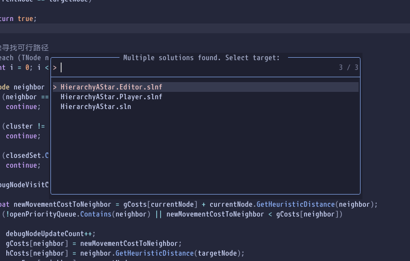
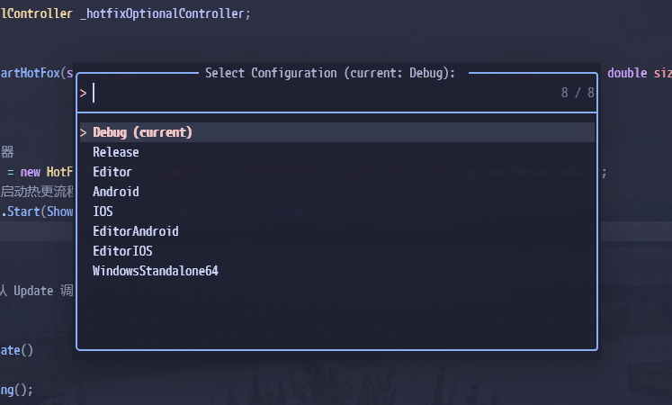
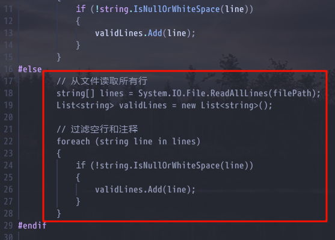

# roslyn.nvim

[English](#roslynnvim) | [中文](#roslynnvim中文说明)

This repository is an actively maintained fork of [seblyng/roslyn.nvim](https://github.com/seblyng/roslyn.nvim).

- Upstream provides the original plugin, architecture, and ongoing Roslyn / Razor support.
- This fork focuses on solution and project resolution for larger or irregular C# workspaces, plus workflow-oriented additions.
- For the original full documentation, background, and upstream-oriented examples, please read the upstream README and wiki:
  - [upstream README](https://github.com/seblyng/roslyn.nvim)
  - [upstream wiki](https://github.com/seblyng/roslyn.nvim/wiki)

## Acknowledgements

Huge thanks to:

- [seblyng/roslyn.nvim](https://github.com/seblyng/roslyn.nvim) for the original plugin and continued upstream work
- the upstream authors and contributors who built the Roslyn / Razor integration this fork extends
- the .NET / Roslyn teams for shipping the open-source language server used here

## Requirements

- Neovim >= 0.12.0
- Roslyn language server downloaded locally
- .NET SDK installed and `dotnet` command available

## What This Fork Changes

The items below summarize the fork-specific work.

### Workspace / Target Resolution

- Reworked solution discovery for better behavior in large repositories and unusual layouts
- Added broader and more reliable root resolution logic for multi-solution workspaces
- Fixed incorrect solution selection in Unity-oriented layouts
- Replaced ad-hoc target guessing with a structured resolution flow based on:
  - discovered solutions
  - upward csproj search
  - explicit user selection when ambiguity remains
- Reworked startup so `root_dir` resolution and `on_init` no longer maintain separate target-selection logic
- Added structured target caching so initialization now depends on cached resolved targets instead of re-searching during `on_init`
- Removed older fork-only mechanisms that became redundant after the resolver rewrite:
  - `choose_target`
  - `lock_target`



### Target State Model

- Replaced `vim.g.roslyn_nvim_selected_solution` with `vim.g.roslyn_nvim_selected_target`
- The new global state is structured as:

```lua
vim.g.roslyn_nvim_selected_target = {
    kind = "solution" or "project",
    target = "/absolute/path/to/file",
}
```

- This lets UI, statusline code, and health checks distinguish between solution-backed and project-backed sessions correctly

### User Interaction Improvements

- When multiple matching solutions remain after filtering, the plugin now prompts the user to choose one instead of failing silently or relying on brittle fallback state
- When no matching solution remains but multiple candidate projects exist, the plugin can prompt for project selection as well
- Selection results are cached per resolved `root_dir` and reused for later initialization

### Extra Commands / UX Additions

- Added `:Roslyn context` to inspect the current Roslyn workspace context
- Added `:Roslyn config` to choose the active build configuration
- Added `:Roslyn unityslnf` to generate Unity-focused `.slnf` files for `UnityEditor` / `UnityPlayer`



### Editor Behavior / UI

- Added `dim_inactive_regions` to gray out code excluded by preprocessor conditions
- Improved diagnostics behavior and performance for larger workspaces



### Maintenance / Internal Refactors

- Moved the customized solution utilities into the same area as upstream solution helpers to reduce future sync pain with upstream
- Simplified fork-specific logic after the resolver rewrite and removed dead code from the customized utility layer
- Expanded and updated tests around multi-solution prompting, cache reuse, and project-mode initialization

## Installing the Roslyn Language Server

### Mason recommended

You can install with:

```vim
:MasonInstall roslyn-language-server
```

The package from `nuget.org` is not necessarily as up to date as the version used in VS Code. For a newer version, configure a custom Mason registry:

```lua
require("mason").setup({
    registries = {
        "github:mason-org/mason-registry",
        "github:Crashdummyy/mason-registry",
    },
})
```

This registry provides:

- `roslyn` — same version as in VS Code
- `roslyn-nightly` — bleeding edge features with potentially breaking changes

### Manual / dotnet tool

`roslyn-language-server` supports Razor since version `5.8.0-1.26262.10`. It can be installed as a [.NET global tool](https://learn.microsoft.com/en-us/dotnet/core/tools/global-tools).

The tool is available from:

- [nuget.org], which is not updated that often
- [Azure DevOps feed], where updates happen multiple times a day

The Azure DevOps feed is recommended.

```bash
# More recent Azure DevOps feed
dotnet tool install -g roslyn-language-server --prerelease --source https://pkgs.dev.azure.com/azure-public/vside/_packaging/vs-impl/nuget/v3/index.json

# nuget.org
dotnet tool install -g roslyn-language-server --prerelease

# Updating works the same way, using update instead of install
dotnet tool update -g roslyn-language-server --prerelease --source https://pkgs.dev.azure.com/azure-public/vside/_packaging/vs-impl/nuget/v3/index.json
```

## Minimal Setup

Install the plugin with your preferred package manager. For full server installation details, Mason notes, and upstream background, please refer to the upstream README.

### `lazy.nvim`

```lua
return {
    "ownself/roslyn.nvim",
    branch = "improvement", -- this fork's actively maintained branch; `main` is kept close to upstream for syncing
    ---@module 'roslyn.config'
    ---@type RoslynNvimConfig
    opts = {
        filewatching = "roslyn",
        broad_search = false,
        silent = false,
        dim_inactive_regions = true,
    },
}
```

## Relevant Options In This Fork

```lua
opts = {
    -- "auto" | "roslyn" | "off"
    filewatching = "roslyn",

    -- Optional filter for solutions that should be ignored during target resolution.
    ignore_target = nil,

    -- Whether to search for solution files in child directories as part of root detection.
    broad_search = false,

    -- Silence initialization notifications.
    silent = false,

    -- Dim code excluded by inactive preprocessor branches.
    dim_inactive_regions = true,
}
```

- `filewatching = "roslyn"` is the default in this fork and is recommended for most setups.
- `auto` lets Neovim participate in watched-file registration when available.
- `off` is a last-resort performance hack and can leave Roslyn with stale workspace state after external file edits.

## Selected Target State

This fork exposes the active target as:

```lua
vim.g.roslyn_nvim_selected_target
```

Example:

```lua
local target = vim.g.roslyn_nvim_selected_target
if target then
    print(target.kind, target.target)
end
```

This is useful for statusline integrations or custom workspace UI.

## Custom Roslyn Extensions

To pass custom Roslyn extensions, override the server command and include one `--extension=/path/to/extension.dll` argument per extension.

```lua
vim.lsp.config("roslyn", {
    cmd = {
        "roslyn-language-server",
        "--stdio",
        "--extension=/path/to/Roslynator.dll",
    },
})
```

## Commands

- `:Roslyn target` chooses a target solution when needed
- `:Roslyn context` shows current Roslyn workspace context
- `:Roslyn config` selects the active build configuration
- `:Roslyn unityslnf` generates a Unity-focused solution filter
- `:Roslyn restart`, `:Roslyn start`, and `:Roslyn stop` are kept for compatibility but follow upstream deprecation toward `:lsp restart roslyn`, `:lsp enable roslyn`, and `:lsp stop roslyn`

## Notes

- If you want the original broader reference documentation, read the upstream README and wiki first.
- If you are working on this fork specifically, prefer the fork behavior documented here over old upstream examples that mention `choose_target`, `lock_target`, or `vim.g.roslyn_nvim_selected_solution`.

---

# roslyn.nvim（中文说明）

这个仓库是基于 [seblyng/roslyn.nvim](https://github.com/seblyng/roslyn.nvim) 持续维护和增强的 fork。

- 上游仓库提供了原始插件、整体架构，以及持续演进的 Roslyn / Razor 支持。
- 这个 fork 更关注大型或结构不规则的 C# 工作区中的 solution / project 解析，以及一些更偏工作流的增强功能。
- 如果你希望阅读原始插件的完整说明、背景介绍或更通用的示例，请优先参考上游文档：
  - [上游 README](https://github.com/seblyng/roslyn.nvim)
  - [上游 Wiki](https://github.com/seblyng/roslyn.nvim/wiki)

## 要求

- Neovim >= 0.12.0
- 已安装 Roslyn language server
- 已安装 .NET SDK，并且 `dotnet` 命令可用

## 这个 Fork 的主要改动

下面内容汇总了 fork 引入的特性。

### 工作区 / Target 解析

- 重做了解决方案发现逻辑，以更好适配大型仓库与不规则目录布局
- 增强了多 solution 工作区下的根目录解析行为
- 修复了 Unity 相关项目中的 solution 选择问题
- 用结构化的 target 解析流程替代了零散的目标猜测逻辑，决策依据包括：
  - 搜索到的 solution
  - 向上搜索到的 csproj
  - 在仍然存在歧义时由用户显式选择
- 重构了启动流程，使 `root_dir` 解析和 `on_init` 不再各自维护一套 target 选择逻辑
- 增加了结构化 target 缓存，`on_init` 现在依赖缓存的解析结果，而不是再次搜索和预测
- 移除了在新版解析模型下已经多余的旧机制：
  - `choose_target`
  - `lock_target`


### Target 状态模型

- 用 `vim.g.roslyn_nvim_selected_target` 替代了 `vim.g.roslyn_nvim_selected_solution`
- 新的全局状态结构如下：

```lua
vim.g.roslyn_nvim_selected_target = {
    kind = "solution" or "project",
    target = "/absolute/path/to/file",
}
```

- 这样 statusline、health 检查和其他 UI 逻辑就能正确区分当前是 solution 模式还是 project 模式

### 用户交互改进

- 当多个 solution 在过滤后仍然无法唯一确定时，插件会提示用户显式选择，而不是静默失败或依赖脆弱的兜底状态
- 当没有可用 solution，但存在多个候选 project 时，插件也支持提示用户选择 csproj
- 用户选择的结果会按 `root_dir` 缓存，并在后续初始化时复用

### 新增命令 / 工作流增强

- 增加了 `:Roslyn context`，用于查看当前 Roslyn 工作区上下文
- 增加了 `:Roslyn config`，用于选择当前构建配置
- 增加了 `:Roslyn unityslnf`，用于为 `UnityEditor` / `UnityPlayer` 生成 Unity 场景下更适合的 `.slnf`


### 编辑器行为 / UI

- 增加了 `dim_inactive_regions`，用于将预处理指令中未激活的代码区域置灰
- 改进了大型工作区下的诊断行为与性能表现


## 最小配置示例

安装方式、Mason 说明以及更完整的 Roslyn 服务器安装背景，请优先参考上游 README。

```lua
return {
    "ownself/roslyn.nvim",
    branch = "improvement", -- 当前 fork 的活跃开发分支；`main` 尽量保持接近上游以便同步
    ---@module 'roslyn.config'
    ---@type RoslynNvimConfig
    opts = {
        filewatching = "roslyn",
        broad_search = false,
        silent = false,
        dim_inactive_regions = true,
    },
}
```

## 这个 Fork 当前相关的配置项

```lua
opts = {
    -- "auto" | "roslyn" | "off"
    filewatching = "roslyn",

    -- 可选过滤函数，用于忽略某些 solution target
    ignore_target = nil,

    -- 是否在子目录中搜索 solution 文件
    broad_search = false,

    -- 是否静默初始化通知
    silent = false,

    -- 是否将未激活的预处理分支代码置灰
    dim_inactive_regions = true,
}
```

- `filewatching = "roslyn"` 是这个 fork 当前的默认值，也推荐作为大多数场景下的首选配置。
- `auto` 表示在可用时让 Neovim 参与 watched-file 注册。
- `off` 仅建议作为最后的性能兜底手段使用；当文件被外部工具修改时，Roslyn 的工作区状态和诊断可能会变旧。

## 当前 Target 状态

这个 fork 会将当前活跃 target 保存在：

```lua
vim.g.roslyn_nvim_selected_target
```

示例：

```lua
local target = vim.g.roslyn_nvim_selected_target
if target then
    print(target.kind, target.target)
end
```

这对于 statusline 集成、自定义工作区 UI 或调试当前解析结果都很有帮助。

## 命令

- `:Roslyn target` 在需要时手动选择 solution target
- `:Roslyn context` 查看当前 Roslyn 工作区上下文
- `:Roslyn config` 选择当前构建配置
- `:Roslyn unityslnf` 生成 Unity 场景下使用的 solution filter
- `:Roslyn restart` / `:Roslyn start` / `:Roslyn stop` 为兼容保留，上游推荐逐步使用 `:lsp restart roslyn` / `:lsp enable roslyn` / `:lsp stop roslyn`

## 说明

- 如果你想阅读原始、完整且更通用的参考文档，请优先查看上游 README 和 Wiki。
- 如果你使用的是这个 fork，请优先参考这里的行为说明，而不是旧的上游示例，尤其是那些仍然提到 `choose_target`、`lock_target` 或 `vim.g.roslyn_nvim_selected_solution` 的内容。

[nuget.org]: https://www.nuget.org/packages/roslyn-language-server
[nvim-lspconfig]: https://github.com/neovim/nvim-lspconfig
[Azure Devops feed]: https://dev.azure.com/azure-public/vside/_artifacts/feed/vs-impl/NuGet/roslyn-language-server.linux-x64
